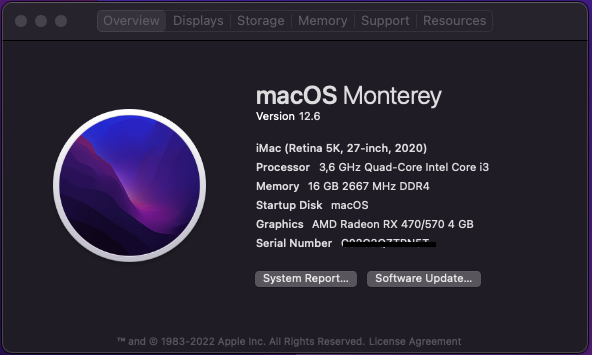
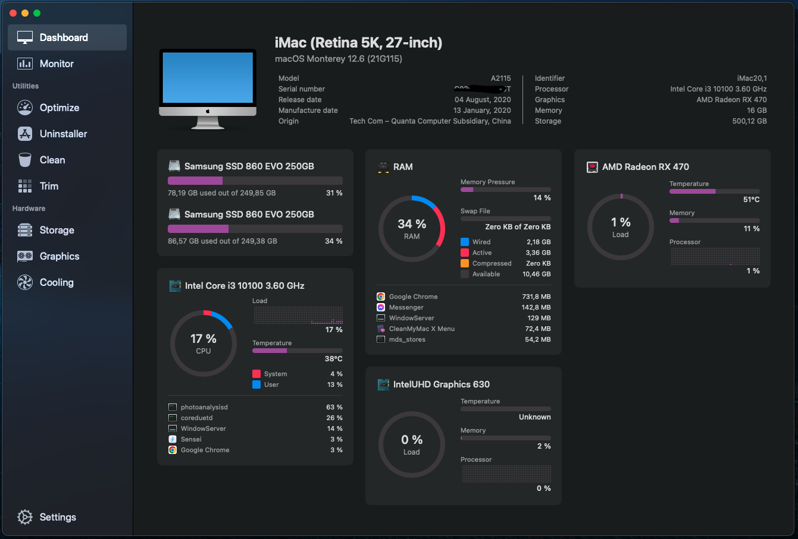
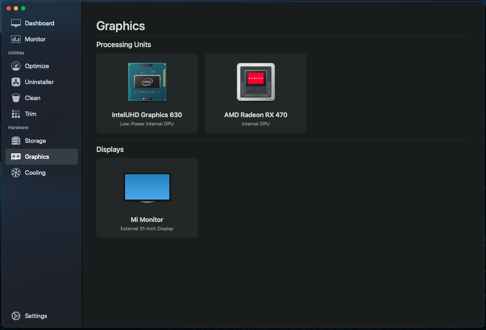

# Commet Lake - H510 - RX470 - OpenCore Hackintosh

## Detail specs

| Component      | Model                      |
| ---------------| -------------------------- |
| CPU            | Intel Core i3-10100        |
| Motherboard    | ASRock H510M-HVS R2.0      |
| iGPU           | Intel UHD Graphics 630     |
| dGPU           | Sapphire RX470 4GB         |
| RAM            | 2 \* 8GB DDR4 2666MHz      |
| SSD            | 2 \* Samsung 860 EVO 250GB |
| WiFi/Bluetooth | BCM94360CS2                |
| Audio          | Realtek ALC897             |
| Ethernet       | Realtek RTL8111            |
| Monitor        | Xiaomi Monitor 24 inches   |
| OS             | macOS Ventura 13           |

## What's working

- [x] Mouse and keyboard
- [x] Intel UHD Graphics 630 (just use for computing tasks, not for display)
- [x] Audio
- [x] Ethernet
- [x] USB 2.0 & 3.0
- [x] Shutdown & Restart
- [x] Sleep & Wake (The fans are still running)
- [x] UI for OpenCore
- [x] iServices (iMessage, Facetime, iCloud)
- [x] AirDrop/Handoff/Continuity

## What's not working

Currently all things are working fine

## BIOS Settings

- [ ] Fast Boot
- [x] VT-d (optional)
- [x] DVMT Pre-Allocated(iGPU Memory): 64M/Auto
- [x] CFG Lock (optional)
- [ ] Secure Boot
- [ ] Intel SGX
- [ ] Intel Platform Trust
- [x] Above 4G Decoding
- [x] Hyper Threading
- [x] SATA Mode: AHCI
- [x] Storage Boot Option Control: UEFI
- [x] USB Configuration: XHCI Hand-off
- [x] Intel Virtualization Technology

## OpenCore Settings

- Add `SMBIOS: iMac20,1`
- Add `MLB`, `SystemSerialNumber`, `SystemUUID`
- Set `ProcessorType` to `0`

## Note

- `OpenCore` version: `0.9.0`
- This shared EFI was tested with both `Ventura 13` and `Monterey 12.6`, made with Release version of `OpenCore 0.9.0`

## Credits

- [Acidanthera](https://github.com/acidanthera)
- [Dortania](https://dortania.github.io/OpenCore-Install-Guide/)
- [RehabMan](https://github.com/RehabMan)

## Contact

- [Facebook](https://facebook.com/buiducnhat47)
- [Telegram](https://t.me/buiducnhat)
- [Reddit](https://reddit.com/user/gerpann)
- [GitHub](https://github.com/buiducnhat)

## Donate

If you like my work, you can buy me a coffee

